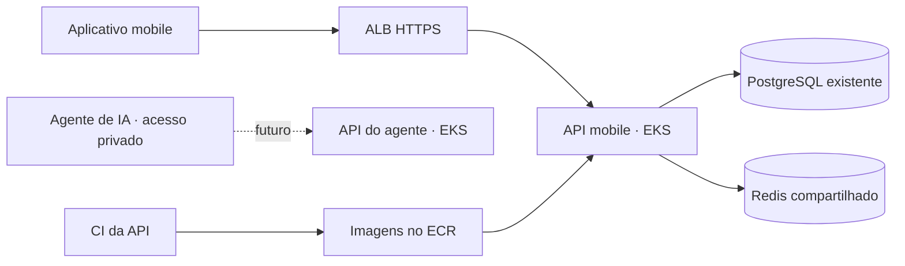

# Kairos Infra

Infraestrutura para duas APIs com deploys independentes no mesmo Amazon EKS:
a API consumida pelo aplicativo mobile e a futura API consumida pelo agente de IA.

Atualmente, **somente mobile-api esta habilitada**, vinculada ao
[KairosApplication/kairos-springboot](https://github.com/KairosApplication/kairos-springboot).
O modelo agent-api permanece desabilitado e nao cria recursos AWS por padrao.



## O que este repositorio fornece

- Terraform: bucket de estado, VPC em duas AZs, subnets privadas, NAT,
  EKS Auto Mode, logs do control plane e ECR com tags imutaveis.
- IAM: autenticacao GitHub OIDC sem chaves permanentes, roles separadas para
  publicar imagens, implantar cada API e ler seus proprios segredos.
- Helm: Deployment, Service, HTTPS no ALB, verificacoes de saude,
  encerramento gradual, limites de recursos, HPA e PDB opcionais.
- Integracao Secrets Manager via CSI e EKS Pod Identity.
- Workflow reutilizavel: testa a API mobile com PostgreSQL, publica a imagem
  com o SHA do codigo e implanta pelo digest, esperando a prontidao.
- CI deste repositorio: valida Terraform, simula infraestrutura sem AWS
  e verifica o comportamento dos manifests renderizados.

O deploy usa GitHub Actions e Helm. O historico Helm e as imagens imutaveis
permitem rollback. Uma alteracao de infraestrutura neste repo executa validacao;
a criacao de recursos AWS e uma etapa separada com Terraform.

## Estrutura

```text
terraform/bootstrap/         Bucket de estado compartilhado
terraform/production/        Rede, EKS, ECR, IAM e metadados dos segredos
charts/kairos-api/           Chart compartilhado pelas APIs
environments/production/    Configuracao especifica de cada API
platform/                   Namespaces, IngressClass e driver de segredos
services.json               Vinculos com os repositorios e APIs habilitadas
.github/workflows/          Validacao e workflow reutilizavel de release
examples/mobile-api/        Workflow chamador, Dockerfile e dockerignore
docs/                       Instalacao, operacao e futura API do agente
```

## Como ativar

Siga [o guia de instalacao](docs/setup.md). Ele cobre conta/regiao AWS,
administrador do cluster, estado Terraform, dominio/certificado, PostgreSQL,
Redis, runner de deploy e configuracao no repositorio da API.

O [workflow chamador](examples/mobile-api/deploy.yml) deve ser copiado para
`.github/workflows/deploy.yml` no kairos-springboot.
`KAIROS_DEPLOY_ENABLED` deve continuar desativado ate concluir a instalacao.

Os exemplos usam IDs, IPs e dominios ficticios. Defina os valores reais
antes de executar Terraform. A regiao de exemplo e us-east-1; escolha a regiao
antes do primeiro apply.

## Dados e escala inicial

PostgreSQL e Redis sao configurados por endpoints no Secrets Manager.
O PostgreSQL pode continuar no Aiven; este repo nao provisiona nem migra bancos.
O Redis precisa ser acessivel a partir das subnets privadas: localhost e o
Redis do Docker Compose local nao servem ao cluster. A sessao da API usa Redis
compartilhado, inclusive durante atualizacoes.

A API mobile usa duas replicas em nos distintos e HPA desabilitado. Integrar
a PR da API que serializa `PostgresAuditInitializer` antes de ativar esse deploy.
DDL ainda deve evoluir para migracoes versionadas e compativeis durante rollout.
Ver [operacao](docs/operations.md) e [automacao](docs/automation.md).

Apenas logs do control plane estao provisionados no CloudWatch. Os logs da
aplicacao ficam em stdout/stderr dos pods; para retencao centralizada, instalar
um coletor como o CloudWatch Observability add-on e conceder suas permissoes.

## Validacao local

Necessario: Terraform 1.13.5, Helm 3.19.0 e Python 3.12.

```sh
terraform fmt -check -recursive terraform
terraform -chdir=terraform/bootstrap init -backend=false -input=false
terraform -chdir=terraform/bootstrap validate
terraform -chdir=terraform/production init -backend=false -input=false
terraform -chdir=terraform/production validate
terraform -chdir=terraform/production test
python -m pip install -r requirements-dev.txt
python -m unittest discover -s tests -v
```

Os testes Terraform usam `mock_provider`; seus applies sao simulados e nao
criam recursos. A CI de validacao usa os mesmos testes simulados. O workflow
`provision.yml` executa planos e applies reais somente depois de configurar AWS,
environments e `KAIROS_INFRA_ENABLED=true`. Ver [automacao](docs/automation.md).

## Custos

Aplicar esta infraestrutura cria recursos cobrados: EKS, nos EC2 do Auto Mode,
NAT Gateway, IPv4, armazenamento, ECR, Secrets Manager e logs. O ALB surge no
primeiro deploy publico. Um NAT e a configuracao inicial; dois NATs oferecem
resiliencia por AZ com custo maior. Planeje atualizacoes da versao Kubernetes
antes do fim do suporte padrao e configure um AWS Budget na conta.

## Referencias

- [EKS Auto Mode](https://docs.aws.amazon.com/eks/latest/userguide/automode.html)
- [ALB no EKS Auto Mode](https://docs.aws.amazon.com/eks/latest/userguide/auto-configure-alb.html)
- [GitHub OIDC e AWS](https://docs.aws.amazon.com/IAM/latest/UserGuide/id_roles_create_for-idp_oidc.html)
- [Secrets Manager com pods EKS](https://docs.aws.amazon.com/eks/latest/userguide/manage-secrets.html)
- [Politicas de rede no Auto Mode](https://docs.aws.amazon.com/eks/latest/userguide/auto-net-pol.html)
