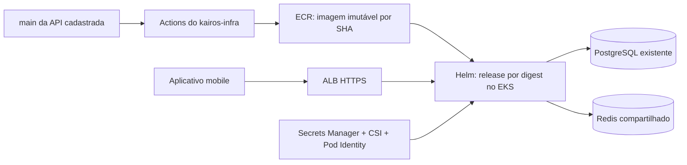

# Kairos Infra

Infraestrutura AWS e automação centralizada de build e deploy das APIs Kairos, com Terraform, Amazon EKS Auto Mode, ECR, Helm e GitHub Actions. Consulte também a [wiki](https://github.com/KairosApplication/kairos-infra/wiki).

## Estado atual

Na revisão de 10/10/2026, a `main` contém apenas a licença. Esta documentação descreve a implementação da [PR #4](https://github.com/KairosApplication/kairos-infra/pull/4), na branch `feat/automated-infrastructure`, ainda em revisão. A [PR #3](https://github.com/KairosApplication/kairos-infra/pull/3) propõe validação estrutural e secret scan; conciliar o workflow de secret scan antes dos merges.

Código publicado e CI verde não comprovam provisionamento ou deploy real. A ativação depende de merge, configuração da conta AWS, estado remoto, roles, environments, runner privado e segredos runtime.

## Serviços e arquitetura

O cadastro explícito em [services.json](services.json) é compartilhado pelo Terraform, bootstrap Kubernetes e matriz de deploy. Não há descoberta automática de todos os repositórios da organização.

| Serviço | Origem | Estado no cadastro |
| --- | --- | --- |
| `mobile-api` | [kairos-springboot](https://github.com/KairosApplication/kairos-springboot) | Habilitado; build Java 21. |
| `agent-api` | Ainda sem repositório definido | Modelo futuro desabilitado; não cria recursos por padrão. |



## O que o repositório fornece

- Terraform para estado S3, VPC em duas zonas, subnets privadas, NAT, EKS Auto Mode, ECR e IAM.
- Roles distintas de provisionamento, publicação, deploy e runtime; autenticação OIDC e chaves AWS opcionais apenas no infra.
- Metadados dos segredos no Secrets Manager; os valores runtime são preenchidos separadamente, fora do Git e do estado Terraform.
- Chart Helm com HTTPS, probes, encerramento gradual, limites de recursos, NetworkPolicy e opções de HPA/PDB.
- Runner privado opcional provisionado por Terraform; o registro no GitHub continua manual.
- Testes simulados de Terraform, testes dos scripts/manifests e validação dos workflows.

## Estrutura e guias

| Caminho | Responsabilidade |
| --- | --- |
| `terraform/bootstrap/` | Bucket de estado; o estado inicial é local e exige backup privado. |
| `terraform/production/` | Rede, EKS, ECR, IAM, metadados de segredos e runner opcional. |
| `charts/kairos-api/` | Chart compartilhado de aplicação. |
| `environments/production/` | Values específicos de cada serviço. |
| `services.json` | Serviços autorizados e habilitados. |
| `platform/` e `scripts/` | Bootstrap, RBAC, validação de plano, seleção de serviços e release. |
| `.github/workflows/` | CI, provisionamento e reconciliação central. |
| `examples/mobile-api/` | Dockerfile Java 21 de fallback. |
| `tests/` | Testes Python dos scripts e manifests renderizados. |

- [Instalação](docs/setup.md): ferramentas, AWS, estado, bancos, plataforma, HTTPS e runner.
- [Automação](docs/automation.md): variables, secrets, environments, roles e cadastro de novas APIs.
- [Operação](docs/operations.md): rollout, rollback, rotação de segredos, escala e diagnóstico.
- [API futura do agente](docs/agent-api.md): requisitos antes de habilitar o segundo serviço.

## Workflows

| Arquivo | Quando executa | Limite/resultado |
| --- | --- | --- |
| `validate.yml` | PR, push na main e manual | actionlint, fmt/validate/test Terraform e testes dos manifests; sem provisionar AWS. |
| `secret-scan.yml` | Conforme seus eventos configurados | Gitleaks com saída mascarada. |
| `provision.yml` | PR para main, push na main e manual | Com `KAIROS_INFRA_ENABLED=true`, gera plano real; só aplica fora de PR e na main. |
| `reconcile.yml` | Manual, a cada 30 minutos e após provisionamento bem-sucedido na main | Com `KAIROS_RECONCILE_ENABLED=true`, resolve a main dos serviços e chama o release. |
| `reusable-release.yml` | Chamada local pelo reconcile | Checkout por SHA, testes/build quando necessário, ECR e rollout EKS. |

O deploy executa exclusivamente no Actions de **kairos-infra**. Não instalar workflow chamador, Secrets AWS ou runner nas APIs nem no repositório `.github`. Push na API não dispara diretamente o infra; o agendamento pode atrasar. Para execução imediata, usar **Deploy connected services → Run workflow**, após a configuração.

Para commits Java ainda sem imagem, o release executa `./mvnw --batch-mode --no-transfer-progress -Ppostgres-tests clean verify`. Imagens existentes são reutilizadas pela tag imutável do SHA e implantadas por digest. O pipeline verifica a origem e revalida o SHA atual da main antes do rollout.

## Ordem de ativação

1. Revisar e integrar a implementação, conciliando workflows das PRs abertas.
2. Escolher conta/região, preparar roles OIDC de plan/apply/plataforma e criar o bucket de estado com `terraform/bootstrap`. Não versionar estado, planos ou tfvars reais.
3. Configurar variables como `AWS_ACCOUNT_ID`, `AWS_REGION`, `TF_STATE_BUCKET`, `INFRA_CONFIG_JSON` e os ARNs das roles, conforme o [guia de automação](docs/automation.md).
4. Criar os environments `infrastructure-plan`, `infrastructure-production` e `production`; exigir revisão antes de dar acesso AWS a código de PR e restringir produção à main.
5. Habilitar `KAIROS_INFRA_ENABLED` após o bootstrap. Revisar o plano salvo antes do apply; o pipeline bloqueia exclusões e substituições destrutivas. Recursos existentes fora do estado exigem importação.
6. Registrar o runner Linux privado com labels `self-hosted`, `linux`, `x64`, `kairos-eks`, restrito ao infra e fora do alcance de PRs não confiáveis. Só então habilitar `KAIROS_PLATFORM_ENABLED` e executar o bootstrap.
7. Preencher o segredo runtime com `DB_URL`, `DB_USERNAME`, `DB_PASSWORD` e `REDIS_URL`; preparar conectividade, domínio, certificado ACM e DNS.
8. Configurar `EKS_CLUSTER_NAME` e `DEPLOY_CONFIG_JSON`. Para APIs privadas, usar GitHub App com Contents read, `DEPLOY_APP_ID` e secret `DEPLOY_APP_PRIVATE_KEY`, limitado às APIs cadastradas.
9. Integrar o lock transacional PostgreSQL da [PR #31 da API](https://github.com/KairosApplication/kairos-springboot/pull/31) antes de ativar duas réplicas. Habilitar `KAIROS_RECONCILE_ENABLED`, executar o primeiro release e verificar login/sessão além de `/health`.

Os comandos de instalação são para Bash/Linux/macOS/WSL. Terraform também pode ser executado no PowerShell. Exemplos de conta, IP e domínio nos guias são fictícios. Publicar documentação não ativa nenhum desses fluxos.

## Validação local sem AWS

Ferramentas usadas pela CI: Terraform 1.13.5, Helm 3.19.0, Python 3.12 e actionlint 1.7.7. Execute na raiz do repositório:

```sh
terraform fmt -check -recursive terraform
terraform -chdir=terraform/bootstrap init -backend=false -input=false -lockfile=readonly
terraform -chdir=terraform/bootstrap validate
terraform -chdir=terraform/production init -backend=false -input=false -lockfile=readonly
terraform -chdir=terraform/production validate
terraform -chdir=terraform/production test -no-color
python -m pip install -r requirements-dev.txt
python -m unittest discover -s tests -v
actionlint -shellcheck= .github/workflows/*.yml
git diff --check
```

Os testes Terraform usam provider simulado; não criam recursos. Os testes Python verificam scripts e manifests renderizados, não um cluster real. Eles não substituem testes funcionais de produção. **Não executar plan/apply/destroy real para validar uma alteração documental.**

## Operação, dados e limites

- PostgreSQL e Redis são serviços existentes: este repo não provisiona nem migra bancos. Redis precisa ser compartilhado e acessível do cluster; `localhost` não funciona entre pods.
- O mobile começa com duas réplicas em nós distintos e HPA desabilitado. A afinidade e `maxSurge=1` podem exigir um terceiro nó durante rollout.
- Helm usa `--atomic --wait`: tenta reverter upgrades com falha; uma instalação inicial com falha é removida. Rollback não desfaz mudanças no banco.
- O reconcile também corrige drift; rollback manual pode ser sobrescrito pelo próximo ciclo. Coordenar a pausa da reconciliação e a revisão de origem antes de uma reversão operacional.
- Rotação no Secrets Manager não atualiza variáveis já carregadas na JVM; após sincronizar, reiniciar pods gradualmente. Nunca imprimir segredos em logs.
- CloudWatch recebe logs do control plane. Logs da aplicação ficam inicialmente em stdout/stderr; retenção centralizada exige coletor separado.
- ALB/HTTPS exige certificado e DNS preparados; HPA exige fonte de métricas instalada e validada.

Consulte [operação](docs/operations.md) antes de alterar capacidade, segredos ou releases.

## Custos e contribuição

Provisionamento cria recursos cobrados na AWS: EKS, EC2, NAT, IPv4, armazenamento, ECR, Secrets Manager, logs e ALB após deploy público. Revise o plano, estime custos e configure orçamento antes de ativar. Esta documentação não comprova disponibilidade, custo final ou implantação real.

Use branches `feat/`, `fix/`, `chore/`, `docs/`, `refactor/` ou `test/`, nunca `codex/`; commits em inglês no padrão `type(scope): description`. Labels devem refletir o diff: `terraform`, `github_actions`, `tests`, `security`, `documentation` e `chore` quando aplicáveis — não `java` por implantar uma API Java.

Após o merge, atualizar esta seção de estado e os links da wiki para a main. README, guias versionados e wiki devem permanecer alinhados. Licença: [MIT](LICENSE).
